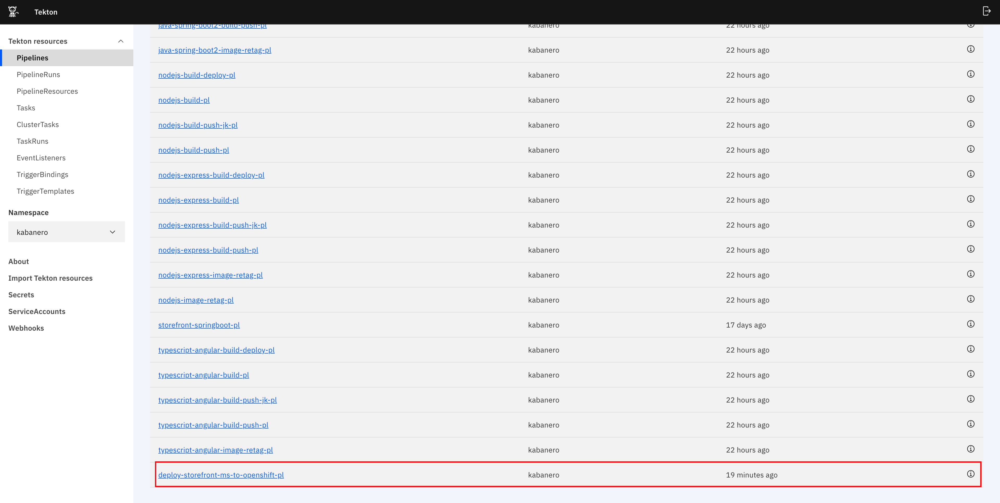
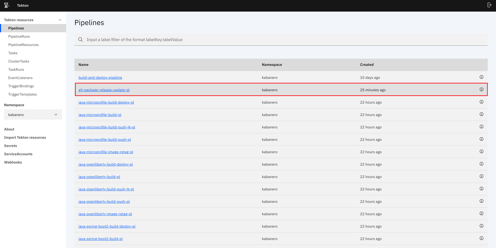

# Extend, Build & Deploy Kabanero Pipelines
Developers that use [Kabanero](https://kabanero.io/) pipelines often times have to extend these pipelines to do certain tasks that do not come
in the out-of-the-box Kabanero pipelines. These tasks may include code coverage, or use third party applications like
[Pact Broker](https://docs.pact.io/pact_broker), [Sonarqube](https://www.sonarqube.org/) or [Artifactory](https://jfrog.com/artifactory/)
to full-fill software requirements. Currently, there are not many methods to manage and version control your Kabanero 
pipelines, and the goal of this repository is to help you get going.

You will learn how to package, host your pipelines in different environments such as Git or Artifactory and use
these pipelines to automate the process of updating the [Kabanero custom resource](https://kabanero.io/docs/ref/general/configuration/kabanero-cr-config.html) 
to a respective host where your Kabanero pipelines exist.

## Table of Contents
  * [Extend, Build & Deploy Kabanero Pipelines](#extend-build--deploy-kabanero-pipelines)
  * [Overview](#overview)
  * [Pre-requisites](#pre-requisites)
  * [How to create a custom stack](#how-to-create-a-custom-stack)
  * [How to release your stacks to Kabanero ](#how-to-release-your-stacks-to-kabanero)
  * [Bound Custom Pipelines to Kabanero Stacks](#bound-custom-pipelines-to-kabanero-stacks)
  * [Host packaged-pipelines on Artifactory](#host-pipelines-on-artifactory)
  * [How to use git-package-release-update pipeline](#how-to-use-git-package-release-update-pipeline)
  * [Host pipelines without version control](#deploy-pipelines-without-version-control)
  * [Create tekton webhook](#create-a-tekton-webhook)
  
# Overview
This repository includes 3 [directories](/pipelines), `experimental`(pipelines that are not production-ready and are considered, proof of concept),`incubator`(pipelines that are not production-ready and require further development to satisfy the stable criteria.) and `stable`(pipelines that are production ready).

This repository also contains multiple [/pipelines/](/pipelines/incubator) such as [artifactory-package-release-update](pipelines/experimental/artifactory-package-release-update), 
[git-package-release-update](/pipelines/experimental/git-package-release-update) and [mcm-pipelines](/pipelines/incubator/mcm-pipelines).
 

There are multiple approaches on packaging and releasing your pipelines. Both the `artifactory-package-release-update` & `git-package-release-update` pipelines do the same thing, package, manage
and deploy your custom pipelines, except hosted in different environments. For example, the `artifactory-package-release-update` pipeline, packages your
pipelines and host them onto Artifactory, where the `git-package-release-update` are hosted as git releases. The goal of this repository
is to get you going in managing your custom made pipelines. 

The `mcm-pipelines` contains the tasks of building, testing, pushing an image and a health-check of a nodejs application. It also
does a `sonar-scan` for code coverage.
   
# Pre-requisites
* Install the following CLI's on your laptop/workstation:

    + [`docker cli`](https://docs.docker.com/docker-for-mac/install/)
    + [`git cli`](https://git-scm.com/downloads)
    + [`oc cli`](https://docs.openshift.com/container-platform/4.3/welcome/index.html)
    + [`Openshift 4.3.5 with CloudPak for Apps`](https://www.ibm.com/cloud/cloud-pak-for-applications)
    + [`tekton cli`](https://github.com/tektoncd/cli)
    

# How to Create a Custom Stack
Lets say you decide to create a new Kabanero custom stack because the Kabanero stacks do not meet your requirement needs. What if you have an Angular application and wanted to incorporate a Kabanero stack across your organization, you can achieve this by creating a Kabanero custom stack. In this section you will be learning how to create a Kabanero custom stack. 

To view the following Kabanero stacks in your `dev.local` repository, run the following command:
```bash
> appsody list dev.local
REPO            ID                              VERSION         TEMPLATES                       DESCRIPTION                                              
dev.local       java-microprofile               0.2.26          *default                        Eclipse MicroProfile on Open Liberty & OpenJ9 using Maven
dev.local       java-openliberty                0.2.3           *default                        Open Liberty & OpenJ9 using Maven                        
dev.local       java-spring-boot2               0.3.27          *default, kotlin                Spring Boot using OpenJ9 and Maven                       
dev.local       nodejs                          0.3.3           *simple                         Runtime for Node.js applications                         
dev.local       nodejs-express                  0.2.10          scaffold, *simple               Express web framework for Node.js                        
```

Now you will be learning on how to create an Angular Typescript stack. Run the following commands to achieve this task. Feel free to make any changes to the `package.json` to include packages for your requirements. 

```bash
appsody stack create typescript-angular --copy incubator/starter
cd typescript-angular
npm install -g @angular/cli@latest 
cd templates/simple
ng new angular-starter-project
cd ../../
appsody stack package
````
Now you can see your new stack on your `dev.local` environment.
```bash
> appsody list dev.local
REPO            ID                              VERSION         TEMPLATES                       DESCRIPTION                                                 
.
.
.                 
dev.local      typescript-angular               9.1.11           *simple                        Runnable Angular v9 starter stack, copy to create a new     
                                                                                                stack                                                     
```
You have completed making a custom stack that other developers can use!


# How to Release your Stacks to Kabanero
To release your stack to the kabanero namespace, you must deploy the container
to docker hub or a registry. You can achieve that by running the following commands.

```bash
> cd Users/YourUserName/.appsody/stacks/dev.local
> ls 
typescript-angular.v9.1.11.source.tar.gz
typescript-angular.v9.1.11.templates.simple.tar.gz
```

Now replace environment variable with your Docker username.

1. Create a docker image and push it to the registry
```bash
export DOCKER_HUB_USERNAME=xxxx
docker tag dev.local/appsody/typescript-angular $DOCKER_HUB_USERNAME/typescript-angular
docker login
docker push $DOCKER_HUB_USERNAME/typescript-angular
```

2. Create a new release on your Github repository.

    - Click on Releases
    - Click Draft a new Release
    - In the Tag Version enter v1.0-typescript-angular
    - Upload file
    - Go to Users/YourUserName/.appsody/stacks/dev.local and select typescript-angular.v9.1.11.source.tar.gz and typescript-angular.v9.1.11.templates.simple.tar.gz
    - Click Publish Release
    - Right click on typescript-angular.v9.1.11.source.tar.gz and typescript-angular.v9.1.11.templates.simple.tar.gz press "copy link address".

3. Generate index file:
From the stack directory you created `typescript-angular` run the following commands to generate the index file.

    ```bash
    > export GITHUB_USERNAME=xxx
    > export GITHUB_REPOSITORY=xxx
    > appsody stack add-to-repo $GITHUB_USERNAME --release-url https://github.com/$GITHUB_USERNAME/$GITHUB_REPOSITORY/releases/latest/download

    ******************************************
    Running appsody stack add-to-repo
    ******************************************
    Creating repository index file: /Users/Oscar.Ricaud@ibm.com/.appsody/stacks/dev.local/oiricaud-index.yaml
    Succesfully generated file: /Users/Oscar.Ricaud@ibm.com/.appsody/stacks/dev.local/oiricaud-index.json
    Repository index file updated successfully
    ```

4. Now edit the `index.yaml` file to include the image you created.
    ```bash
    > cd /Users/YOUR-COMPUTER-USERNAME/.appsody/stacks/dev.local
    > vim $GITHUB_USERNAME-index.yaml
    ```
    Edit the file and update the `image` key.

    ```yaml
       templates:
        - id: simple
        url: https://github.com/oiricaud/devops-demo-kabanero-pipelines/releases/download/v1.37/typescript-angular.v9.1.11.templates.simple.tar.gz
        image: docker.io/$DOCKER_USERNAME/typescript-angular
    ```
    Go back to the release you just generated edit the release, and now upload the `$GITHUB_USERNAME-index.yaml` file that you just edited.

5. Edit the Kabanero Custom Resource to include your new custom stack.

    ```bash 
    oc login --token=enter-token --server=enter-server
    oc project kabanero
    oc get kabanero -o yaml
    ```
    You should get a similar output: 

    ```yaml
    .
    .
    .
    stacks:
        pipelines:
        - https:
            url: https://github.com/kabanero-io/kabanero-pipelines/releases/download/0.6.2/default-kabanero-pipelines.tar.gz
        id: default
        sha256: bfda9cd86f6054e8f58304c283ca571ec80435880a875ae1ade02c8ec24756ea
        repositories:
        - https:
            url: https://github.com/kabanero-io/kabanero-stack-hub/releases/download/0.6.5/kabanero-stack-hub-index.yaml
        name: central
    targetNamespaces:
    ```
    You will now add the following section to the `https` key.
    Remember to get the URL value you must go to your releases and copy and paste your `index`

    The `image` key is the image you upload to docker hub.

    ```yaml
    url: https://github.com/$GITHUB_USERNAME/$GITHUB_REPOISTORY/releases/download/v1.37/oiricaud-index.yaml
    name: typescript-angular
    versions:
    - images:
        - id: typescript-angular
        image: docker.io/yellocabins/typescript-angular:latest
    ```

    Now you can apply your changes by running:
    `oc apply -f kabanero.json`

    The result should look like the following image.
    


# Bound Custom Pipelines to Kabanero Stacks
It is pretty easy to bound your custom pipelines onto the default kabanero stacks. Kabanero has the following out-of-the-box stacks

- Java Microprofile
- Java Openliberty
- Java Spring Boot
- NodeJS
- Nodejs Express

You can reuse these stacks to bound your custom pipelines, and if you are not familiar with what Stacks are you can visit this link for more [info](https://kabanero.io/developer/cli/). Essentially, Kabanero Stacks are container images prebuilt with run times and frameworks.For example, in this repository there are custom pipelines that we have created for our requirement needs.

- [mcm-pipelines](pipelines/incubator/mcm-pipelines)
- [cloud-foundry](/pipelines/experimental/cloud-foundry)
- [deploy-app-ibm-cloud](/pipelines/experimental/deploy-app-ibm-cloud)
- [git-package-release-update](/pipelines/experimental/git-package-release-update)
- [artifactory-package-release-update](/pipelines/incubator/artifactory-package-release-update)

If you wanted to bound let's say, `deploy-app-ibm-cloud` or a custom pipeline that you created to all the kabanero default stacks as shown above. We can achieve that by following the steps:
1. Inspect the current pipeline, tasks and trigger bindings. We currently have in `deploy-app-ibm-cloud` pipeline.
    ```yaml
    apiVersion: tekton.dev/v1alpha1
    kind: Pipeline
    metadata:
      name: deploy-app-ibm-cloud-pl
      namespace: kabanero
    .
    .
    .
    ```
    We must update the pipeline, trigger-binding and trigger-template yaml and include the following comment at the top of your yaml.
    ```yaml
    #Kabanero! on activate substitute StackId for text 'StackId' 
    ```
    You also must add `StackId-` to the name of your pipeline. If the name of your pipeline is `abc-pl` the result is `StackId-abc-pl`. Look at the following for the `deploy-app-ibm-cloud` pipeline example:
    ```yaml
    #Kabanero! on activate substitute StackId for text 'StackId'
    apiVersion: tekton.dev/v1alpha1
    kind: Pipeline
    metadata:
      name: StackId-deploy-app-ibm-cloud-pl
      namespace: kabanero
    .
    .
    .
    ``` 
2. Repeat for the Trigger bindings same process as step 1. The result should look like the following:
    
    TriggerBinding for pull request
    ```yaml
    #Kabanero! on activate substitute StackId for text 'StackId' 
    apiVersion: tekton.dev/v1alpha1
    kind: TriggerBinding
    metadata:
      name: StackId-deploy-app-ibm-cloud-pl-pullrequest-binding
      namespace: tekton-pipelines
    .
    .
    .
    ```
    TriggerBinding for push
    ```yaml
    #Kabanero! on activate substitute StackId for text 'StackId'
    apiVersion: tekton.dev/v1alpha1
    kind: TriggerBinding
    metadata:
      annotations:
        manifestival: new
      name: StackId-deploy-app-ibm-cloud-pl-push-binding
      namespace: tekton-pipelines
    .
    .
    .
    ```

    TriggerTemplate 
    ```yaml
    #Kabanero! on activate substitute StackId for text 'StackId'
    apiVersion: tekton.dev/v1alpha1
    kind: TriggerTemplate
    metadata:
      annotations:
         manifestival: new
      name: StackId-deploy-app-ibm-cloud-pl-push-pl-template
      namespace: tekton-pipelines
    ```

3. Go back to section to [Package pipelines](#package-pipelines) for your new version of pipelines.

4. Go to your Tekton Dashboard -> Pipelines. Or you can also open the terminal and run the following:

    ```bash
      > tkn pipeline list
        java-openliberty-deploy-app-ibm-cloud-pl
        java-spring-boot2-deploy-app-ibm-cloud-pl
        nodejs-deploy-app-ibm-cloud-pl
        nodejs-express-deploy-app-ibm-cloud-pl
    ```
       


# Host pipelines on Artifactory
### Pre-reqs
You need to deploy [Artifactory](https://github.com/ibm-cloud-architecture/gse-devops/tree/master/cloudpak-for-integration-tekton-pipelines#artifactory) on your Openshift cluster

You need to generate an [API Key](https://www.jfrog.com/confluence/display/JFROG/User+Profile). Then you need to go to
[artifactory-config.yaml](../../../../Downloads/devops-demo-kabanero-pipelines-master/configmaps/artifactory-config.yaml) and update the `artifactory_key`. Once done, run the following
commands:

```bash
oc project kabanero
cd ./configmaps
oc apply -f artifactory-config.yaml
```

Then go to [pipelines](../../../../Downloads/devops-demo-kabanero-pipelines-master/pipelines) make any modifications you want to do to any of the pipelines, or include your own.
If you do include your pipelines, use the [skeleton](pipelines/skeleton) to add your modified pipelines, tasks,
bindings, and templates. 

``` bash
cd pipelines/experimental
oc apply --recursive --filename pipelines/experminetal/artifactory-package-release-update/
```

Go to the dashboard and verify that the `artifactory-package-release-update-pl` has been added to the Tekton dashboard
Go to section [Create tekton webhook](#create-a-tekton-webhook) to create your web hook.
Once you are done with that go to your forked repository and make a change, and your Tekton dashboard should create a 
new pipeline run as shown below:

You could also manually trigger your pipelines


Where the `git-source` is defined as the pipeline resource with key [url] and value [github repo url] 

The end result should look like the following:


# How to use git-package-release-update pipeline
You can use a pipeline to automate the process of extending, packaging and releasing your pipelines via a Git Release. The process is very similar to the section above. The only difference is that we will use a pipeline to automate the tedious steps. You can skip this section if you already did the section before and are not interested in using a pipeline to automate the process of extending, packaging and releasing your pipelines.

Pre-requisites:
1)  You must create a new repo such as `devops-pipelines`, you will be using the `devops-pipelines` repository to build your pipelines. Clone this [repository](https://github.com/ibm-garage-ref-storefront/devops-pipelines) and add your pipelines to any of the folders `experimental`, `incubator`, `stable`.

    If you inspect `./pipelines/` you can create a new folder for each new pipeline you have and follow a similar structure as below.

    ```bash
    .
    ├── experimental
    │   ├── README.md
    │   ├── abc
    │   │   ├── bindings
    │   │   │   ├── abc-pl-pullrequest-binding.yaml
    │   │   │   └── abc-pl-push-binding.yaml
    │   │   ├── configmaps
    │   │   │   └── abc-pl-configmap.yaml
    │   │   ├── pipelines
    │   │   │   └── abc-pl.yaml
    │   │   ├── secrets
    │   │   │   └── abc-pl-secret.yaml
    │   │   ├── tasks
    │   │   │   └── abc-task.yaml
    │   │   └── template
    │   │       └── abc-pl-template.yaml
    │   └── manifest.yaml
    ├── incubator
    │   ├── README.md
    │   ├── cde
    │   │   ├── bindings
    │   │   │   ├── cde-pl-pullrequest-binding.yaml
    │   │   │   └── cde-pl-push-binding.yaml
    │   │   ├── configmaps
    │   │   │   └── cde-pl-configmap.yaml
    │   │   ├── pipelines
    │   │   │   └── cde-pl.yaml
    │   │   ├── secrets
    │   │   │   └── cde-pl-secret.yaml
    │   │   ├── tasks
    │   │   │   └── cde-task.yaml
    │   │   └── template
    │   │       └── cde-pl-template.yaml
    │   └── manifest.yaml
    └── stable
    │   ├── README.md
    │   ├── fgh
    │   │   ├── bindings
    │   │   │   ├── fgh-pl-pullrequest-binding.yaml
    │   │   │   └── fgh-pl-push-binding.yaml
    │   │   ├── configmaps
    │   │   │   └── fgh-pl-configmap.yaml
    │   │   ├── pipelines
    │   │   │   └── fgh-pl.yaml
    │   │   ├── secrets
    │   │   │   └── fgh-pl-secret.yaml
    │   │   ├── tasks
    │   │   │   └── fgh-task.yaml
    │   │   └── template
    │   │       └── fgh-pl-template.yaml

    ```
    Now drag and drop your pipelines and tasks to any of these folders, remember pipelines in `expermental` do not get built.

2) You must update the `configmap` and `secret` we provided for you. But first, create another repository such as `devops-server`. In this repo `devops-server` you will be hosting your pipelines as Git releases. Do not forget to create a README.md file.

    Navigate to `pipelines/incubator/git-package-release-update/configmaps` and update the `pipeline-server-configmap.yaml`

    ```yaml
    apiVersion: v1
    kind: ConfigMap
    metadata:
    name: pipeline-server-configmap
    namespace: kabanero
    data:
        repo_org: your-github-username-or-org
        repo_name: your-github-repo-where-you-will-host-pipelines
        image_registry_publish: 'false'
        kabanero_pipeline_id: pipeline-manager
    ```

    Update the secret in `pipelines/incubator/git-package-release-update/secrets/`

    ```yaml
    apiVersion: v1
    kind: Secret
    metadata:
        name: pipeline-server-git
        namespace: kabanero
        type: kubernetes.io/basic-auth
    data:
        password: your-git-token-encoded
        username: your-git-username-encoded
    ```
    
    Now run the following command to be able to retrieve resources for the `kabanero-pipeline` service account.

   ```bash
    oc adm policy add-cluster-role-to-user view system:serviceaccount:kabanero:kabanero-pipeline
    ```
    
3) Create web hook for the `devops-pipelines` repository you created on step 1.

4) Deploy your pipeline, tasks, event bindings and trigger templates by running the following command in the `devops-pipelines` repo you created on step 1:

    ```bash
    oc apply --recursive --filename pipelines/incubator/git-package-release-update
    git add .
    git commit -m "adding new pipelines..."
    git push
    ```
    Your output should be the following:
    
    <br>
    If you go to the `devops-server` repo you created on step 2, you should see a new release with your zip files as shown below:
    
    <br>
    Now inspect your Kabanero Custom Resource to ensure your `default-kabanero-pipelines.tar.gz` got added to the `pipelines` key value pair.
    ```bash
    oc get kabanero -o yaml
    ```
    ```yaml
    stacks:
      pipelines:
      - https:
          url: https://github.com/ibm-garage-ref-storefront/pipelines-server/releases/download/1.0/default-kabanero-pipelines.tar.gz
        id: pipeline-manager
        sha256: 8fe10018016e5059640b1a790afe2d6a1ff6c4f54bf3e7e4fa3fc0f82bb2207d
    ```
    The pipelines that you added to the `devops-pipelines` repository should now be visible on the tekton dashboard as shown below:
    
    <br>
      

    Now you can reuse these pipelines across your organization! If your cluster comes down you now have a backup of your pipelines.

# Create a tekton webhook 
### Pre-reqs

You need to create an access token on the tekton dashboard or cli in the kabanero namespace.
Earlier you created a github token on the github dashboard. You will need to get that token or generate another one and 
paste it below.


Web hook Settings:

    Name: devops-demo-kabanero-pipelines
    Repistory-url: your forked repo url goes here
    Access Token: Token you generated previously 

Target Pipeline Settings
        
    Namespace: kabanero
    Pipeline: Choose artifactory-package-release-update-pl or git-package-release-update-pl
    Service Account: Pipeline
    Docker Registry: us.icr.io/project-name or docker.hub.io/projectname
        
# Deploy pipelines without Version Control 
You can but not recommended non-version control your pipelines by running the following command

``` bash
oc apply --recursive --filename pipelines/{pick expiermental, incubator or stable}
```

